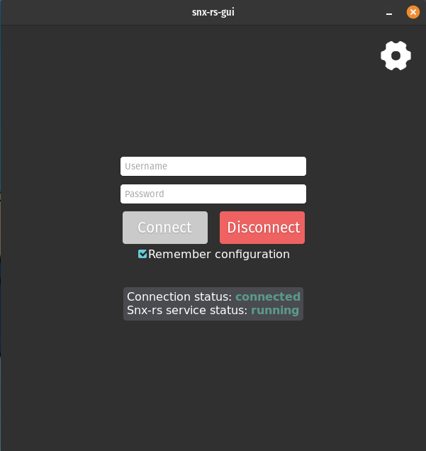
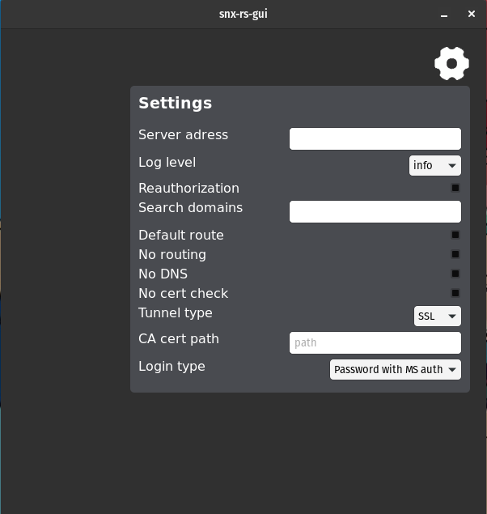

# snx-rs-gui
Rust gui app for the [snx-rs](github.com/ancwrd1/snx-rs). Written with Dioxus gui library.

## Build
Folowing https://dioxuslabs.com/docs/0.3/guide/en/publishing/desktop.html install and run cargo-bundle --release

## Prerequisites
Have running snx-rs service in `-m command` mode

## Limitations
- You need to have installed 

| Package       | Install command                               |
|---------------|-----------------------------------------------|
| libwebkit2gtk | sudo apt-get install -y libwebkit2gtk-4.1-dev |

## Usage
- For configuring multiple search domains, separate them with a space:  `domain1 domain2 domain3`

## Next steps
- Add enter press support for connecting action.
- Implement trey icon

## Compatible snx-rs versions
- 0.3.0
- 0.3.1
- 0.3.2
- 0.3.3
- 0.4.0